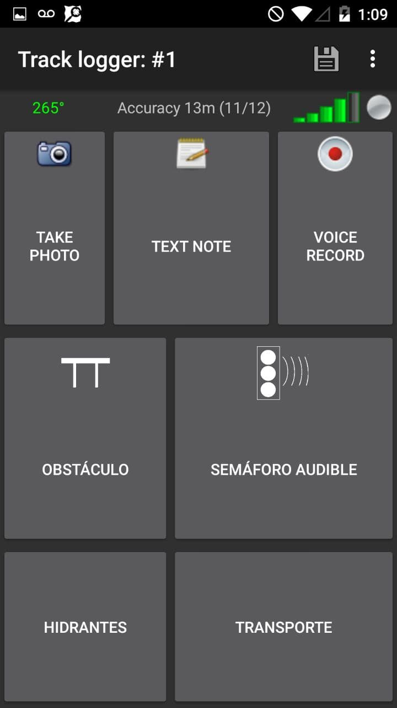
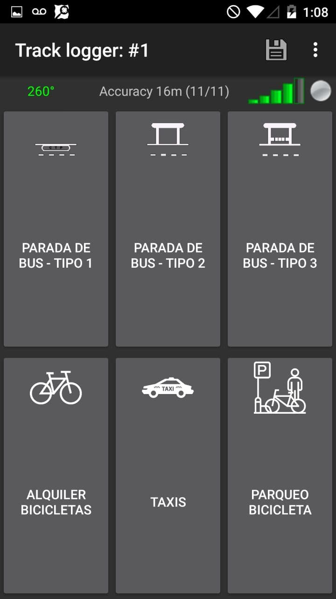
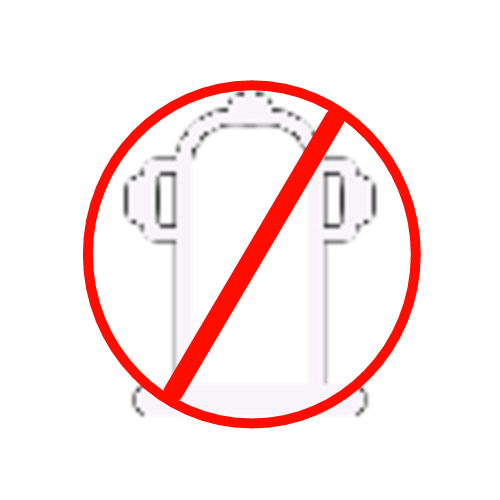

# Disposición de botones Bëküo

Esta disposición de botones (DisBo) facilita la recolección de datos para mapear elementos de accesibilidad, hidrantes y movilidad. Esta DisBo ha sido creada por el grupo de investigación/extensión Bekuo del [Laboratorio Experimental](labexp.org) como parte de sus tareas.  A continuación se ofrece una tabla que documenta los botones incluidos en la DisBo y su eventual uso al editar el mapa de Open Street Map (OSM).

|  |  |  |
| ----------------------------------------------- | ----------------------------------------------- | ----------------------------------------------- |
|                                                 |                                                 |                                                 |

La imagen de la izquierda es la DisBo de entrada, permite capturar elementos de accesibilidad y nos llega a las otras dos pantallas, la de hidrantes y de movilidad. Estas últimas dos serán explicadas más abajo en este archivo.  

Las siguientes tabla pretenden guiar la asociación entre distintos tipos de elementos encontrados en el campo con el mapa de OSM. La primera columna presenta el ícono que aparecen en la disposición de botones. La segunda y tercera columna describen con una imagen y texto, las características de cada elemento para identificarlo en el campo mientras se capturan datos.  La cuarta columna indica el texto que aparecerá en el archivo en el punto del GPX  (*waypoint*) luego de presionar el botón. La última columna es una sugerencia de esquema de mapeo para incorporar los datos capturados a OSM.

## Entrada

| Ícono  |Ejemplo| Texto del punto en el GPX (waypoint)  | Descripción   | Esquema de mapeo sugerido en OSM   |
|--------|-------|---------------------------------------|---------------|------------------------------------|
|| | Obstáculo  | Obstáculo: cualquier tipo de obstáculo en una acera o zona de paso que dificulte o imposibilite el paso accesible.  | Nodo : ` barrier=chain` `barrier=cable_barrier` `barrier=handrail` `barrier=kerb` `barrier=cattle_grid` `barrier=debris`[1] |
|||  Semáforo audible  | Semáforo audible, con un nivel de sonido claro.|Nodo : ` crossing=traffic_signals`  `traffic_signals:sound=walk` `traffic_signals:sound=yes` |

El esquema de mapeo sugerido está basado en las páginas wiki:

*  [Key:barrier](https://wiki.openstreetmap.org/wiki/ES:Key:barrier).
* [crossing=traffic_signals](https://wiki.openstreetmap.org/wiki/ES:Tag:crossing%3Dtraffic_signals)

[1] Al encontrar un nodo de tipo obstáculo, es necesario indicar que solo se debe utilizar una de las etiquetas ejemplificadas en la tabla.

## Hidrantes

| Ícono                                                        | Ejemplo                                                      | Descripción                                                  | Texto del punto en el GPX (waypoint) | Esquema de mapeo sugerido en OSM                             |
| ------------------------------------------------------------ | ------------------------------------------------------------ | ------------------------------------------------------------ | ------------------------------------ | ------------------------------------------------------------ |
| (<u>Por hacer</u>: incluir ícono) Hidrante Seco              |  | También conocido como "hidrante seco", necesario una bomba.  | Hidrante Seco                        | Nodo : `emergency=fire_hydrant` `fire_hydrant:type=pipe |
|  Hidrante de Pilar |  | Un hidrante de tipo pilar. Para información específica leer [`pillar:type=*`](https://wiki.openstreetmap.org/w/index.php?title=ES:Tag:emergency%3Dfire_hydrant#pillar:type.3D.2A) | Hidrante de Pilar                    | Nodo : `emergency=fire_hydrant` `fire_hydrant:type=pillar` |
|  Hidrante de Pared |  | Hidrante colocado en una pared.                              | Hidrante de Pared                    | Nodo : `emergency=fire_hydrant` `fire_hydrant:type=wall` |
| (<u>Por hacer</u>: incluir ícono) Hidrante Subterráneo       |  | El hidrantes está bajo tierra, es necesario un tubo vertical. | Hidrante Subterráneo                 | Nodo : `emergency=fire_hydrant` `fire_hydrant:type=underground` |
| Otro tipo de hidrante (desconocido): |                                                              | Tipo de hidrante desconocido.                                | Hidrante Desconocido                 | Nodo : `emergency=fire_hydrant` `fire_hydrant:type=unknown` |
|  Hidrante fuera de servicio. |                                                              | Se supone que los hidrantes están en funcionamiento de manera  predeterminada. En caso contrario, si el hidrante está fuera de  servicio, use esta etiqueta. | Hidrante fuera de servicio           | Nodo : `disused:emergency=fire_hydrant` |

El esquema de mapeo sugerido está basado en la [wiki de la etiqueta `emergency=fire_hydrant`](https://wiki.openstreetmap.org/wiki/ES:Tag:emergency%3Dfire_hydrant).

## Movilidad

| Ícono                                                        | Ejemplo                                                      | Descripción                                                  | Texto del punto en GPX (waypoint) | esquema de mapeo sugerido en osm                             |
| ------------------------------------------------------------ | ------------------------------------------------------------ | ------------------------------------------------------------ | --------------------------------- | ------------------------------------------------------------ |
|  |  | Este tipo de parada se identifica porque únicamente existe una raya amarilla en la calle (con las letras CTP pintadas). Esta raya está ubicada al lado de la acera en el sentido que circula el bus. | PARADA DE BUS - TIPO 1            | Nodo : `public_transport=platform` `highway=bus_stop` |
|  |                                                              | Además de la raya amarilla en la calle, esta parada tiene algún techo o casetilla. | PARADA DE BUS - TIPO 2            | Nodo : `public_transport=platform` `highway=bus_stop` `shelter=yes` |
|  |  | Además de la raya amarilla en la calle y el techo, esta parada tiene una banca. | PARADA DE BUS - TIPO 3            | Nodo : `public_transport=platform` `highway=bus_stop ` `shelter=yes` `bench=yes` |
|  |                                                              | Punto de alquiler bicicletas (recoger y dejar).              | ALQUILER BICICLETAS               | Nodo : `amenity=bicycle_rental` |
|  |                                                              | Paradas de taxis                                             | TAXIS                             | Nodo : `amenity=taxi` |
|  |                                                              | Estacionamiento de bicicletas                                | PARQUEO BICICLETA                 | Nodo : `amenity=bike_parking` |

El esquema de mapeo sugerido está basado en las páginas wiki:

* [Transporte Público](https://wiki.openstreetmap.org/wiki/Public_transport)
* [amenity=taxi](https://wiki.openstreetmap.org/wiki/Tag:amenity%3Dtaxi)
* [amenity=bicycle_parking](https://wiki.openstreetmap.org/wiki/Tag:amenity%3Dbicycle_parking)
* [amenity=bicycle_rental](https://wiki.openstreetmap.org/wiki/Tag:amenity%3Dbicycle_rental).  

