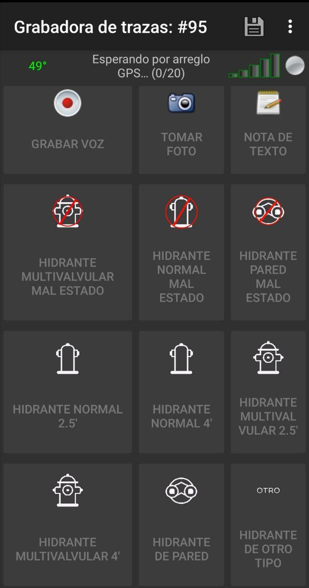

# Disposición de botones para captura de datos de hidrantes
Una vez descargada la disposición de botones ser verá como la siguiente:

La siguiente tabla pretende guiar la asociación entre distintos tipos de hidrantes encontrados en el campo con el mapa de Open Street Map. La primera columna presenta el ícono que aparecen en la disposición de botones. La segunda y tercera columna describen con una imagen y texto, las características de cada hidrante para identificarlo en el campo mientras se capturan datos.  La cuarta columna indica el texto que aparecerá en el archivo en el punto del GPX  (*waypoint*) luego de presionar el botón. La última columna es una sugerencia de esquema de mapeo para incorporar los datos capturados a Open Street Map. El esquema de mapeo sugerido está basado en la [wiki de la etiqueta `emergency=fire_hydrant`](https://wiki.openstreetmap.org/wiki/ES:Tag:emergency%3Dfire_hydrant).

| Ícono                                                        | Ejemplo                                                      | Descripción                                                  | Texto del punto en el GPX (waypoint) | Esquema de mapeo sugerido en OSM                             |
| ------------------------------------------------------------ | ------------------------------------------------------------ | ------------------------------------------------------------ | ------------------------------------ | ------------------------------------------------------------ |
| (<u>Por hacer</u>: incluir ícono) Hidrante Seco              |  | También conocido como "hidrante seco", necesario una bomba.  | Hidrante Seco                        | Nodo : `emergency=fire_hydrant` `fire_hydrant:type=pipe |
|  Hidrante de Pilar |  | Un hidrante de tipo pilar. Para información específica leer [`pillar:type=*`](https://wiki.openstreetmap.org/w/index.php?title=ES:Tag:emergency%3Dfire_hydrant#pillar:type.3D.2A) | Hidrante de Pilar                    | Nodo : `emergency=fire_hydrant` `fire_hydrant:type=pillar` |
|  Hidrante de Pared |  | Hidrante colocado en una pared.                              | Hidrante de Pared                    | Nodo : `emergency=fire_hydrant` `fire_hydrant:type=wall` |
| (<u>Por hacer</u>: incluir ícono) Hidrante Subterráneo       |  | El hidrantes está bajo tierra, es necesario un tubo vertical. | Hidrante Subterráneo                 | Nodo : `emergency=fire_hydrant` `fire_hydrant:type=underground` |
| Otro tipo de hidrante (desconocido): |                                                              | Tipo de hidrante desconocido.                                | Hidrante Desconocido                 | Nodo : `emergency=fire_hydrant` `fire_hydrant:type=unknown` |
|  Hidrante fuera de servicio. |                                                              | Se supone que los hidrantes están en funcionamiento de manera  predeterminada. En caso contrario, si el hidrante está fuera de  servicio, use esta etiqueta. | Hidrante fuera de servicio           | Nodo : `disused:emergency=fire_hydrant` |
