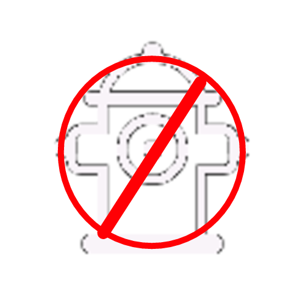

# Disposición de hidrantes
Al abrir la aplicación, se notará que no hay muchos cambios con respecto al layout original, únicamente el botón de "Restricción" se ha visto afectado, y ahora ha pasado a ser el botón que nos llevará a la pantalla en la que se presentan las opciones para mapear diferentes tipos de hidrantes, dicho botón lleva el nombre de "Hidrantes OSM".

## ¿Qué me permite hacer cada botón dentro de este nuevo Layout?

Al abrir la opción para el mapeo de los hidrantes, además de permitirnos hacer las funciones de grabar la voz, tomar una foto o bien una nota de texto, se presentan nueve nuevas opciones.

Estos botones nos van a permitir seleccionar concretamente 3 tipos diferentes de hidrantes, dos de las 9 opciones de botones personalizados, son para hidrantes multivalvulares ( de 4' o de 2.5'), otros dos están destinados para los hidrantes normales ( de 4' o de 2.5'), uno para los hidrantes que están colocados en paredes así como una opción para mapear otro tipo de hidrante diferente a los presentados en los botones. De la misma manera, se presentan 3 botones más, estos nos serán de utilidad a la hora en la que nos encontremos un hidrante de tipo multivalvular, normal o de pared en mal estado.

| Ícono                                                        | Texto del punto en GPX            | Descripción                                             | Esquema de mapeo sugerido en OSM                             |
| ------------------------------------------------------------ | --------------------------------- | ------------------------------------------------------- | ------------------------------------------------------------ |
|  | Hidrante Multivalvular Mal Estado | Hidrante de pilar con múltiples válvulas en mal estado. | Nodo : `disused:emergency=fire_hydrant`  `fire_hydrant:type=pillar` |
|  | Hidrante normal mal Estado        | Hidrante de una válvula en mal estado.                  | Nodo : `disused:emergency=fire_hydrant` `fire_hydrant:type=pillar` |
|  | Hidrante Pared Mal Estado         | Hidrante de pared en mal estado.                        | Nodo : `disused:emergency=fire_hydrant` `fire_hydrant:type=wall` |
|  | Hidrante Normal 2.5'              | Hidrante de una válvula de 2.5 pulgadas.                | Nodo : `emergency=fire_hydrant`  `fire_hydrant:type=pillar` `fire_hydrant:diameter=2.5` |
|  | Hidrante Normal 4'                | Hidrante de una válvula de 4 pulgadas.                  | Nodo : `emergency=fire_hydrant`  `fire_hydrant:type=pillar` `fire_hydrant:diameter=4` |
|  | Hidrante Multivalvular 4'         | Hidrante con válvulas de 2.5 y 4 pulgadas.              | Nodo : `emergency=fire_hydrant`  `fire_hydrant:type=pillar` `fire_hydrant:diameter=2.5` `fire_hydrant:diameter=4` |
|  | Hidrante de Pared                 | Hidrante de pared.                                      | Nodo :  `emergency=fire_hydrant`  `fire_hydrant:type=wall` |
|  | Hidrante de otro tipo             |                                                         | Nodo : `emergency=fire_hydrant` |

