# Disposición de botones de reciclaje y gestión de residuos sólidos

<!--
Una vez descargada la disposición de botones ser verá como la siguiente:

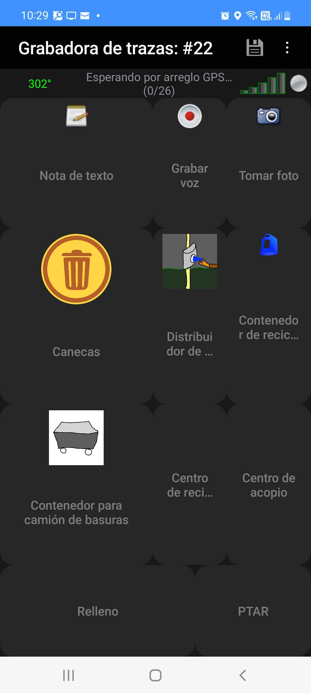
-->

Estos son los botones y su descripción para tomar en terreno elementos asociados al reciclaje y la gestión de residuos sólidos (basuras). Igualmente indica cómo se deben mapear en OSM.

# Main page / Pantalla principal

| Icon / Ícono  | Example / Ejemplo  | Description / Descripción  | Text on the GPX point / Texto del punto en el GPX (waypoint)  | OSM mapping schema / Esquema de mapeo sugerido en OSM  |
| ------ | -------- | ------------ | ------------------------------------- | --------------------------------- |
| Page / página  |   | Waste basket / Caneca  | - | - |
| 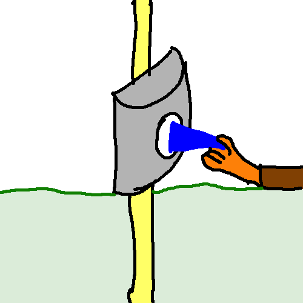 |  | Place with available bags for pickup and collection of animal waste. / Distribuidor de bolsas para excrementos de perros | Vending excrement bags / Distribuidor de bolsas | Node : `vending=excrement_bags` |
| Page / página 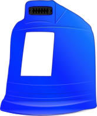 |  | Recycling container / Contenedor de reciclaje |  | - | - |
| 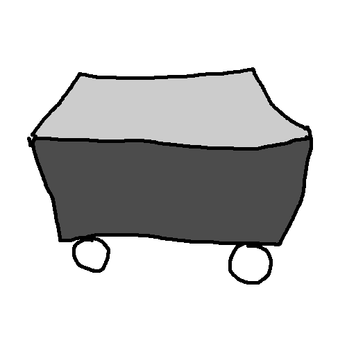 |  | Waste disposal is used for medium and large waste bins, typically for bagged up household or industrial waste. They may be in the street, but they are not primarily for use by passing pedestrians. / Contenedor para camión de basuras | Waste container / Contenedor para camión de basuras | Node : `amenity=waste_disposal` |
| - |  | These centres are dedicated areas for collecting a wider range of recyclable household materials / Centro de reciclaje | Recycling center / Centro de reciclaje | Node : `amenity=recycling` + `recycling_type=centre` |
| - |  | A waste transfer station is a location that accepts, consolidates and transfers waste in bulk, usually from government or commercial collections. / Centro de acopio | Waste transfer station / Centro de acopio | Node : `amenity=waste_transfer_station` |
| -|  | A site for permanent or long term storage of waste materials / Relleno | Landfill / Relleno | Node : `landuse=landfill` |
| - |  | A wastewater plant (also known as sewage works, sewage treatment plant, wastewater treatment plant, reclamation plant) is a facility used to treat wastewater / PTAR | Wastewater plant / PTAR | Node : `man_made=wastewater_plant` |

# Bins / Canecas

| Icon / Ícono  | Example / Ejemplo  | Description / Descripción  | Text on the GPX point / Texto del punto en el GPX (waypoint)  | OSM mapping schema / Esquema de mapeo sugerido en OSM  |
| ------ | -------- | ------------ | ------------------------------------- | --------------------------------- |
|  |  | A waste basket is a single small container for depositing garbage that is easily accessible for pedestrians. / Caneca para basuras | Trash / Caneca para basuras | Node : `amenity=waste_basket` |
| 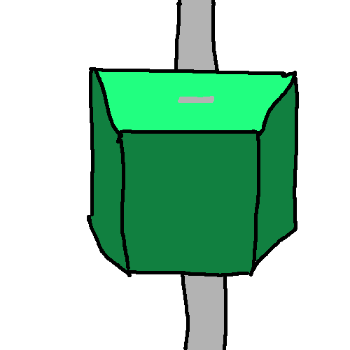 |  | Bin on streetlamp / Caneca sobre poste | Bin on streetlamp / Caneca sobre poste | Node , way , area : (`bench=*`, `shelter=*`, `public_transport=platform`) + `bin=yes` |
|  |  | Dog excrement bin / Caneca para desecho de animal | Dog excrement bin / Caneca para desecho de animal | Node : `amenity=waste_basket` + `waste=dog_excrement` |
| 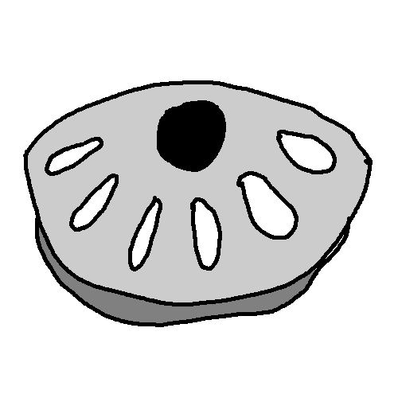 |  | Cigarettes bin / Caneca para cigarrillos | Cigarettes bin / Caneca para cigarrillos | Node : `amenity=waste_basket` + `waste=cigarettes` |

# Recycling containers / Contenedores de reciclaje

| Icon / Ícono  | Example / Ejemplo  | Description / Descripción  | Text on the GPX point / Texto del punto en el GPX (waypoint)  | OSM mapping schema / Esquema de mapeo sugerido en OSM  |
| ------ | -------- | ------------ | ------------------------------------- | --------------------------------- |
| Page / página | - | Plastic/Batteries/Oil / Plástico/Baterías/Aceite |  |  |
| - |  | Paper / Papel | Paper / Papel | Node : `amenity=recycling` + `recycling_type=container` + (`recycling:paper` or `recycling:cardboard` or `recycling:cartons` or `recycling:paper_packaging` or `recycling:magazines` or `recycling:newspapers`) |
| 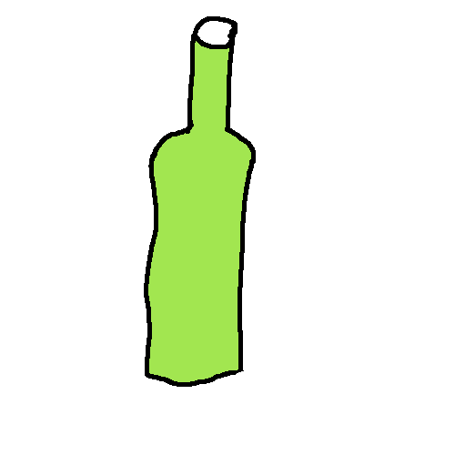 |  | Glass / Vidrio | Glass / Vidrio | Node : `amenity=recycling` + `recycling_type=container` + `recycling:glass_bottles` or `recycling:glass_bottles:colour` |
| Page / página  |  | Electrical/Electronics / Eléctricos/Electrónicos |  |  |
| 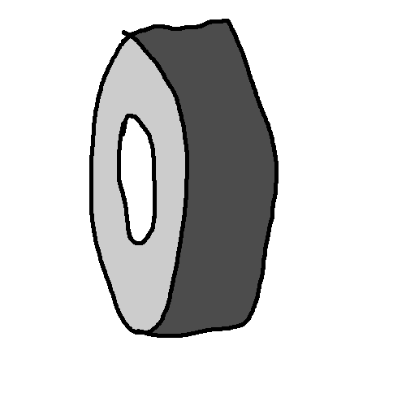 |  | Tyres / Llantas | Tyres / Llantas | Node : `amenity=recycling` + `recycling_type=container` + `recycling:tyres` |
| 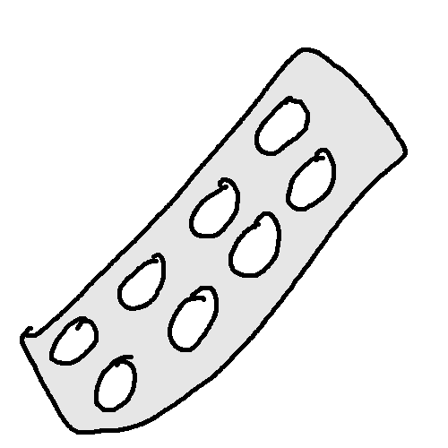 |  | Drugs / Medicinas | Drugs / Medicinas | Node : `amenity=recycling` + `recycling_type=container` + `recycling:drugs` |
| - |  | Compost / Compostaje | Compost / Compostaje | Node : `amenity=recycling` + `recycling_type=container` + `recycling:green_waste` |

# Plastic-Batteries-Oil / Plásticos-baterías-aceite

| Icon / Ícono  | Example / Ejemplo  | Description / Descripción  | Text on the GPX point / Texto del punto en el GPX (waypoint)  | OSM mapping schema / Esquema de mapeo sugerido en OSM  |
| ------ | -------- | ------------ | ------------------------------------- | --------------------------------- |
| - |  | All plastic / Plástico general | All plastic / Plástico general | Node : `amenity=recycling` + `recycling_type=container` + (`recycling:plastic` or `recycling:plastic_bags` or `recycling:plastic_bottles` or `recycling:plastic_packaging`) |
| - | - | Polystyrene foam / Icopor / poliestireno | Polystyrene foam / Icopor / poliestireno | Node : `amenity=recycling` + `recycling_type=container` + `recycling:polystyrene_foam` |
| 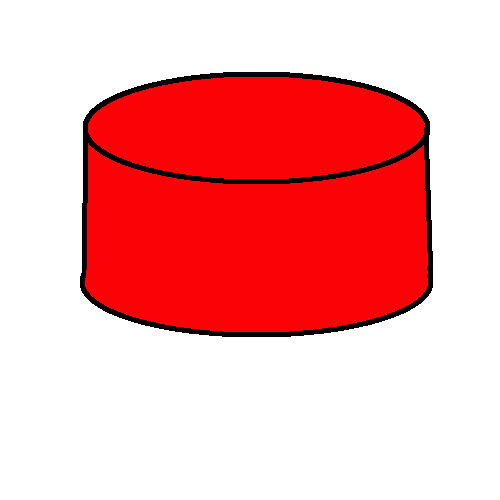 |  | Plastic bottle caps / Tapas de botellas | Plastic bottle caps / Tapas de botellas | Node : `amenity=recycling` + `recycling_type=container` + `recycling:plastic_bottle_caps` |
| 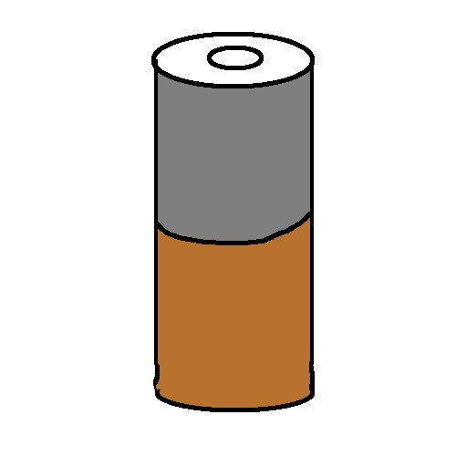 |  | Batteries / Baterías y pilas | Batteries / Baterías y pilas | Node : `amenity=recycling` + `recycling_type=container` + `recycling:batteries` |
| 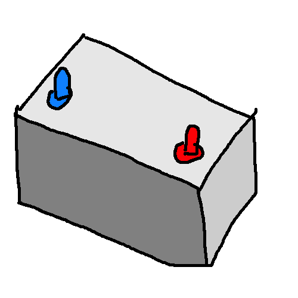 |  | Car batteries / Baterías de carro | Car batteries / Baterías de carro | Node : `amenity=recycling` + `recycling_type=container` + `recycling:car_batteries` |
| 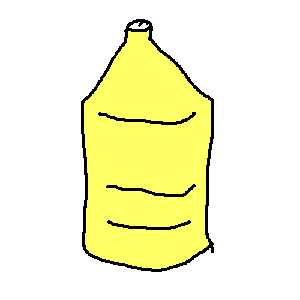 |  | Cooking oil / Aceite de cocina | Cooking oil / Aceite de cocina | Node : `amenity=recycling` + `recycling_type=container` + `recycling:cooking_oil` |
| 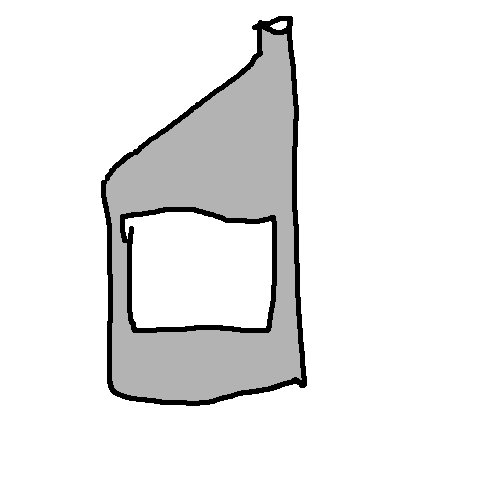 |  | Engine oil / Aceite de carro | Engine oil / Aceite de carro | Node : `amenity=recycling` + `recycling_type=container` + `recycling:engine_oil` |

# Electric and electronics / Eléctricos y electrónicos

| Icon / Ícono  | Example / Ejemplo  | Description / Descripción  | Text on the GPX point / Texto del punto en el GPX (waypoint)  | OSM mapping schema / Esquema de mapeo sugerido en OSM  |
| ------ | -------- | ------------ | ------------------------------------- | --------------------------------- |
| 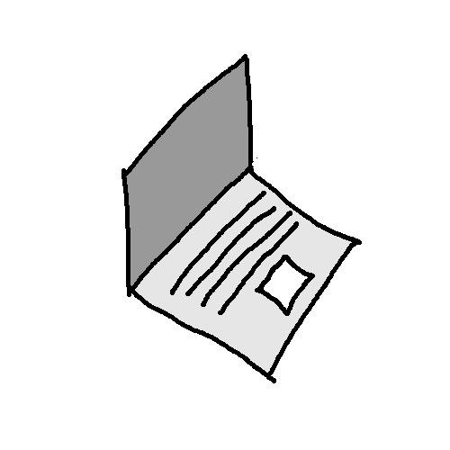 |  | Computers / Computadores | Computers / Computadores | Node : `amenity=recycling` + `recycling_type=container` + `recycling:computers` |
| 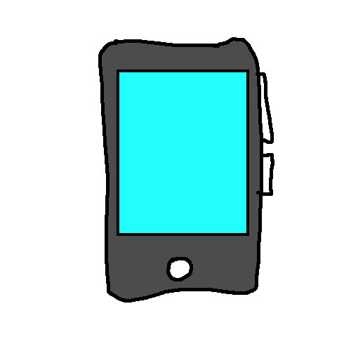 |  | Mobile phones / Celulares | Mobile phones / Celulares | Node : `amenity=recycling` + `recycling_type=container` + `recycling:mobile_phones` |
| - |  | Electronics / Electrónicos | Electronics / Electrónicos | Node : `amenity=recycling` + `recycling_type=container` + (`recycling:small_electrical_appliances` or `recycling:small_appliances` or `recycling:electrical_appliances` or `recycling:electrical_items` or `recycling:electronics`) |
| 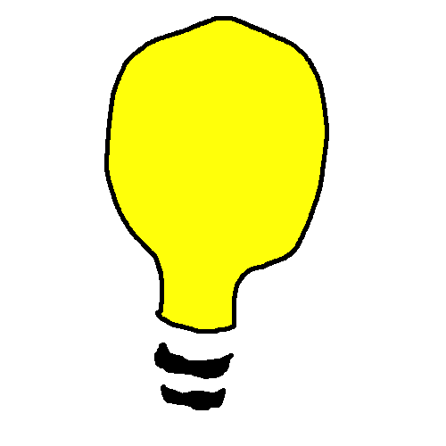 | - | Bulbs / Bombillos | Bulbs / Bombillos | Node : `amenity=recycling` + `recycling_type=container` + (`recycling:light_bulbs` or `recycling:low_energy_bulbs` or `recycling:fluorescent_tubes`) |

